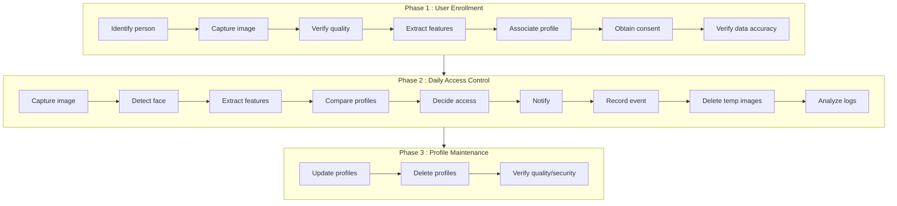

# Artificial Intelligence (AI) - Risk Management - Case Study

## Purpose of the Document

This document illustrates an application of the **artificial intelligence (AI) risk management method**.

**[Foreword](#foreword)**  
**[Introduction](#introduction)**  
**[Method Application](#method-application)** 
&nbsp;&nbsp;&nbsp;&nbsp;[Study Scope](#study-scope) 
&nbsp;&nbsp;&nbsp;&nbsp;[Compliance Approach](#compliance-approach) 
&nbsp;&nbsp;&nbsp;&nbsp;[Scenario-based Approach](#scenario-based-approach)  
**[Deliverables](#deliverables)** 
&nbsp;&nbsp;&nbsp;&nbsp;[Statement of Applicability (SoA)](#statement-of-applicability-soa) 
&nbsp;&nbsp;&nbsp;&nbsp;[Fundamental Rights Impact Assessment (FRIA)](#fundamental-rights-impact-assessment-fria) 
&nbsp;&nbsp;&nbsp;&nbsp;[Data Protection Impact Assessment (DPIA)](#data-protection-impact-assessment-dpia) 
&nbsp;&nbsp;&nbsp;&nbsp;[Security dossier for system accreditation](#security-dossier-for-system-accreditation) 

## Foreword

This document is part of a [set of methodological documents](https://github.com/matthieu-grall/ai), under continuous improvement, designed to help organizations manage AI-related risks, and which can be useful together or separately.
The [reference documents](https://github.com/matthieu-grall/ai/blob/main/IA%20-%20Gestion%20des%20risques%20-%20Documents%20de%20r%C3%A9f%C3%A9rence.md) are used in brackets within the document body.

It is placed under the following **license**:
_[Creative Commons Attribution 4.0 International License][cc-by]_.

[![CC BY 4.0][cc-by-image]][cc-by]

[cc-by]: http://creativecommons.org/licenses/by/4.0/
[cc-by-image]: https://i.creativecommons.org/l/by/4.0/88x31.png
[cc-by-shield]: https://img.shields.io/badge/License-CC%20BY%204.0-lightgrey.svg

The main **contributors** are as follows:
- Matthieu GRALL.

The document **versions** are as follows:
| 
Version
 | 
Action
 | 
Editor
 |
| --- | --- | --- |
| 10/02/2026 (v0.1) | Document creation based on the French method annex | Matthieu GRALL |
| 13/04/2026 (v0.2) | Include a Mermaid drawing for the functional description, move and enrich SoA | Matthieu GRALL |

## Introduction

This case study concerns a small company that wishes to secure access to a specific area of its premises using a biometric device.

As part of its security accreditation process, it needs to produce a security dossier.

In addition, it wishes to comply with the [RGPD] and the [Règlement IA].

As part of its regulatory compliance obligations, the company needs to:
- Comply with the [Règlement IA] (EU AI Act) as the facial recognition system is classified as a high-risk AI system under Annex III (biometric identification);
- Ensure [RGPD] compliance for the processing of biometric personal data.

The company must produce comprehensive documentation including:
- Security dossier for system accreditation
- Fundamental Rights Impact Assessment (FRIA) as required by the [Règlement IA]
- Data Protection Impact Assessment (DPIA) as required by the [RGPD]

## Method Application

### Study Scope

The study is presented as follows:
- **study subject**: controlling access to a secure zone using a facial recognition device;
- **study objectives**: assessing device security, building compliance with [RGPD] and [Règlement IA];
- **study recipients**: internal accreditation committee, data protection officer (DPO) and, where applicable, competent authorities.

The risk level that the study subject is likely to generate is estimated as:
- **risk level estimation scale** (it is chosen to adopt a real wide vision, and therefore to define scales allowing the estimation of consequences on people and on the organization):

| 
**Risk Level**  (and correspondence with [Règlement IA])
 | 
**Potential Consequences on People**  (cf. [Guide PIA-3])
 | 
**Potential Consequences on the Organization**  (cf. [EBIOS _Risk Manager_] and [CRA] compliance impacts)
 |
| --- | --- | --- |
| 1. Minimal  ("Minimal or no risk", e.g.: spam filters, gadget AI) | 1. Negligible: data subjects will not be impacted or might experience some inconveniences that they will overcome without difficulty E.g.: time lost to repeat procedures or to wait to carry them out, receipt of unsolicited mail (e.g.: _spam_), feeling of privacy violation without real or objective harm (e.g.: commercial intrusion) | G1. Minor: negligible consequences for the organization (no operational impact on activity performance or on people and property safety, the organization will overcome the situation without too much difficulty (margin consumption), minor [CRA] non-conformities easily remediated) E.g.: very limited disruption, no sensitive data, rapid recovery, no legal or reputational impact, minor documentation gaps |
| 2. Limited  ("Limited risk", e.g.: chatbot, non-critical generative AI) | 2. Limited: data subjects might experience significant inconveniences that they can overcome despite some difficulties E.g.: minor physical condition (e.g.: benign illness following non-compliance with contraindications), cost increase (e.g.: insurance price increase), relational difficulties with personal or professional entourage (e.g.: image, tarnished reputation, loss of recognition) | G2. Significant: significant but limited consequences for the organization (activity performance degradation without impact on people and property safety, the organization will overcome the situation despite some difficulties (degraded mode operation), [CRA] non-conformities requiring remediation plan) E.g.: temporary degradation, low-sensitivity data, rapid intervention, potential market surveillance inquiry |
| 3. High  ("High risk", e.g.: AI for health, employment, justice) | 3. Significant: data subjects might experience significant consequences that they should be able to overcome, but with real and significant difficulties E.g.: serious physical condition causing long-term harm (e.g.: health deterioration following poor care, or non-compliance with contraindications), banking ban, serious psychological condition (e.g.: depression, phobia development) | G3. Serious: significant consequences for the organization (strong activity performance degradation, with possible significant impacts on people and property safety, the organization will overcome the situation with serious difficulties (very degraded mode operation), serious [CRA] violations, potential CE marking suspension) E.g.: sensitive data compromise, prolonged interruption, crisis management necessary, legal and reputational risks, market access restrictions |
| 4. Maximum  ("Unacceptable risk", e.g.: social scoring, manipulation, mass biometric surveillance) | 4. Maximum: data subjects might experience significant, even irreparable consequences that they might not overcome E.g.: death (e.g.: murder, suicide, fatal accident), inability to work, long-term or permanent psychological condition | G4. Critical: disastrous consequences for the organization (inability for the organization to ensure all or part of its activity, with possible serious impacts on people and property safety, the organization will likely not overcome the situation (its survival is threatened), severe [CRA] violations, CE marking withdrawal, product recall, fines up to €15M or 2.5% of total turnover) E.g.: massive critical data leak, widespread malfunction, major legal/reputational impact, sustainability risk, permanent market ban |

- **risk level estimation**: the risk level is judged as high on people and the organization, but rather low on the environment; the retained risk level is therefore 3. High.
- **follow-up actions**: with this level, both compliance and scenario-based approaches should be implemented.

### Compliance Approach

Compliance with best practices is assessed and addressed as follows:
- **choice of best practices framework**: since it involves implementing an AI system processing personal data, it is chosen to use [AI best practices](https://github.com/matthieu-grall/ai/blob/main/IA%20-%20Gestion%20des%20risques%20-%20Bonnes%20pratiques.md), with particular focus on information security (considering [Guide sécurité de la CNIL] and [CRA]) and privacy protection (considering fundamental principles of [RGPD] and AI-specific best practices [Recos CNIL]);
- **compliance assessment with selected best practices and planned additional measures**.

A Statement of Applicability (SoA) has been provided, in order to explain and assess the implemented or planned practices (see [Statement of Applicability (SoA)](#statement-of-applicability-soa)).

This SoA hase been used by the compliance officer to evaluate the answers and suggest additional measures.

A risk treatment plan has been established in order to implement the suggested measures:
| Additional measure | Responsible department | Estimated added value | Estimated difficulty | Implementation timeline (months) |
| --- | --- | --- | --- | --- |
| Establish a documented oversight process, define periodic reviews, and implement internal controls | Management / Data Protection Officer | High — strengthens accountability and governance | Medium | 2–3 months |
| Conduct structured stress tests, evaluate edge cases, and document performance thresholds | IT / System Integrator | High — improves robustness and reduces operational errors | Medium–High | 3–4 months |
| Expand dataset diversity, test performance across demographic variations, and document bias mitigation steps | IT / HR (for data collection coordination) | High — reduces fairness and equality risks | High | 4–6 months |
| Implement automated update mechanisms, enable scheduled patching, and integrate vulnerability monitoring tools | IT / Security | High — significantly improves security posture | Medium | 2–3 months |
| Provide layered notices, explain system logic and error rates, and offer clear rights procedures | Management / Legal / Communications | Medium–High — improves transparency and user trust | Low–Medium | 1–2 months |

### Scenario-based Approach

The study subject is described in detail:
- **purpose**: control physical access to a secure zone;
- main **business assets**: training data, biometric templates, captured data, facial recognition function, identification results;
- detailed **functional description**:

- main **supporting assets**: hardware components (cameras, sensors, processing units) that connect to networks, software components (facial recognition algorithms using Hidden Markov Models, access control management software), training environment, production environment, developers, administrators, secure zone;
- main **stakeholders**: algorithm publisher, software solution publishers (operating system, servers, etc.).

The **scales** are constructed:

- for privacy protection (cf. [RGPD]), the **severity of consequences on people** will be estimated using the [PIA-3] guide scale;

- for information security (cf. [ISO/IEC 27005]) and [CRA] compliance, the **severity of consequences on the organization** will be estimated using the following scale (adapted for a small technology company):

| 
Severity of Consequences on Organization
 | 
Financial Consequences
 | 
Operational Consequences
 | 
Reputational Consequences
 | 
Legal and Regulatory Consequences
 |
| --- | --- | --- | --- | --- |
| 1. Minimal | Up to €5,000 | Minor service degradation affecting <10% of users for <1 day, no security compromise | Internal awareness only, no external visibility | No regulatory action, internal documentation gaps only |
| 2. Limited | €5,000 - €50,000 | Service degradation affecting <50% of users for <1 week, or limited security incident contained quickly | Local media mention or industry awareness, temporary customer concern | Regulatory inquiry, minor [CRA] non-conformity, potential market surveillance review, corrective action required |
| 3. Significant | €50,000 - €250,000 | Major service disruption affecting >50% of users for >1 week, or significant security incident requiring customer notification | National media coverage, customer complaints, loss of new business opportunities | Formal regulatory investigation, [CRA] violation proceedings, [RGPD] sanctions, potential CE marking suspension, mandatory corrective actions |
| 4. Maximum | >€250,000 or >5% of annual revenue | Complete service failure >1 month, or critical security breach compromising all customer data | Widespread negative media coverage, major customer defections, industry reputation damage | Severe [CRA] violations with fines up to €15M or 2.5% total turnover, [RGPD] fines up to €20M or 4% total turnover, CE marking withdrawal, product recall, potential company insolvency |

- for compliance with [Règlement AI] requirements, the **severity of consequences on fundamental rights** (cf. [Charte UE]) will be estimated using the following scale:

| 
Severity of Consequences on Fundamental Rights
 | 
Consequences on Dignity (cf. Art. 1–5)
 | 
Consequences on Freedoms (cf. Art. 6–19)
 | 
Consequences on Equality (cf. Art. 20–26)
 | 
Consequences on Solidarity (cf. Art. 27–38)
 | 
Consequences on Citizenship (cf. Art. 39–46)
 | 
Consequences on Justice (cf. Art. 47–54)
 |
| --- | --- | --- | --- | --- | --- | --- |
| 1. Minimal | Unpleasant experience without physical or moral harm (e.g. inappropriate online comments) | Light or temporary restrictions (e.g. blocking non-critical content) | Prejudice or light disadvantageous treatment (e.g. stereotypical comments) | Limited access to social resources or protections (e.g. delay in aid delivery) | Minor difficulties exercising civic rights (e.g. one-time administrative problem to vote) | Slow procedures or complex formalities without major consequence (e.g. delay in complaint processing) |
| 2. Limited | Limited physical or psychological harm (e.g. targeted harassment) | Restricted access to information or communication (e.g. targeted censorship) | One-time or limited discrimination (e.g. service denial based on unauthorized criterion) | Partial access to essential services (e.g. delayed or incomplete medical treatment) | Partial restrictions on participation or information rights (e.g. delay in access to public documents) | Biased procedures or minor errors (e.g. partially incorrect or questionable judgment) |
| 3. Significant | Serious harm to integrity (e.g. physical violence, coercive constraint) | Significant limitation of fundamental freedoms (e.g. demonstration ban, intrusive surveillance) | Systemic or repeated discrimination (e.g. biased recruitment algorithm) | Significant deprivation of social rights or protections (e.g. prolonged exclusion from healthcare system) | Serious limitation of civic or political participation (e.g. inability to vote or seek legal remedy) | Unfair procedures resulting in serious harm (e.g. unjustified conviction, disproportionate sanction) |
| 4. Maximum | Major harm to life or integrity (e.g. torture, slavery, endangering life) | Total deprivation of freedoms (e.g. arbitrary detention, prohibition of speech or belief) | Major discrimination affecting access to social or professional life (e.g. total exclusion from employment, housing or service) | Critical deprivation resulting in vital risk or serious social harm (e.g. prohibition of access to vital care or minimum protection) | Total deprivation of civic and democratic rights (e.g. complete exclusion from electoral system, impossibility of access to justice) | Total absence of remedy or serious violation of procedural rights (e.g. arbitrary conviction, major inequitable treatment) |
 
- the **likelihood** will be estimated using the following scale:

| 
Likelihood
 | 
Description
 |
| --- | --- |
| 1. Minimal | The risk source is unlikely to achieve its intended objective according to one of the envisaged attack chains. Scenario likelihood is low |
| 2. Limited | The risk source is likely to achieve its intended objective according to one of the envisaged attack chains. Scenario likelihood is significant |
| 3. Significant | The risk source will probably achieve its intended objective according to one of the envisaged attack chains. Scenario likelihood is high |
| 4. Maximum | The risk source will certainly achieve its intended objective according to one of the envisaged attack chains OR such a scenario has already occurred within the organization (incident history) |

- **risk assessment** and residual risks will be performed using the following mapping:

| 
Risk Assessment
 |  | 
Likelihood
 |  | |  |
| --- | --- | --- | --- | --- | --- |
|  | | **1. Minimal** | **2. Limited** | **3. Significant** | **4. Maximum** |
| **Severity** | **4. Maximum** | Tolerable under control | Tolerable under control | Unacceptable | Unacceptable |
|  | **3. Significant** | Acceptable as is | Tolerable under control | Tolerable under control | Unacceptable |
|  | **2. Limited** | Acceptable as is | Acceptable as is | Tolerable under control | Tolerable under control |
|  | **1. Minimal** | Acceptable as is | Acceptable as is | Acceptable as is | Tolerable under control |

The following table presents the **risk appreciation**:

| 
Risk
 | 
Business Value
 | 
Feared Event
 | 
Severity** (and main consequences)
 | 
Main Risk Source** (and intended objectives)
 | 
Main Strategic Scenario
 | 
Main Operational Scenario** (detail below)
 | 
Likelihood
 |
| --- | --- | --- | --- | --- | --- | --- | --- |
| R01 | Facial recognition function | Disappearance | 2. Limited (operational: blocked access) | Organized crime (extortion) | Direct attack | Physical or logical destruction | 2. Limited |
| R02 | Facial recognition function | Undesired modification | **3. Significant (fundamental rights / privacy: discrimination)** | State actor / competitor (sabotage or manipulation) | Attack via model publisher | Bias injection into model | **3. Significant** |
| R03 | Facial recognition function | Unauthorized access | 1. Minimal (image) | Malicious employee (resale) | Direct attack | Algorithm or parameter exfiltration | 1. Minimal |
| R04 | Training data | Disappearance | 2. Limited (human and financial cost) | Organized crime (targeted sabotage) | Direct attack | Dataset deletion or corruption | 2. Limited |
| R05 | Training data | Undesired modification | 2. Limited (fundamental rights / privacy: bias, discrimination) | Competitor (sabotage) | Direct attack | Training data poisoning | 2. Limited |
| R06 | Training data | Unauthorized access | 2. Limited (privacy) | Organized crime (resale) | Direct attack | Sensitive data exfiltration | 1. Minimal |
| R07 | Biometric templates | Disappearance | 2. Limited (operational: blocked access) | Organized crime (sabotage) | Direct attack | Data deletion | **3. Significant** |
| R08 | Biometric templates | Undesired modification | **3. Significant (security: unauthorized person access)** | State actor (infiltration) | Attack via software publisher | Data alteration | **4. Maximum** |
| R09 | Biometric templates | Unauthorized access | **4. Maximum (fundamental rights / privacy: impersonation, template unusable for life)** | Organized crime (impersonation) | Direct attack | Exfiltration via API | **3. Significant** |
| R10 | Captured data | Disappearance | 2. Limited (operational: blocked access) | Vandal (ideology) | Direct attack | Camera sabotage | 2. Limited |
| R11 | Captured data | Undesired modification | **3. Significant (security: unauthorized person access, operational: blocked access)** | State actor (infiltration) | Direct attack | False data injection | 2. Limited |
| R12 | Captured data | Unauthorized access | 2. Limited (privacy) | State actor (espionage) | Direct attack | Video stream exfiltration | **3. Significant** |
| R13 | Identification results | Disappearance | 2. Limited (operational: blocked access) | Organized crime (extortion) | Direct attack | Data deletion | 3. Significant |
| R14 | Identification results | Undesired modification | **3. Significant (security: unauthorized person access)** | State actor (infiltration) | Direct attack | Result modification | 2. Limited |
| R15 | Identification results | Unauthorized access | **3. Significant (security: replay for unauthorized person access)** | State actor (infiltration) | Direct attack | False result usage | 2. Limited |

The following table presents the detail of **operational scenarios**:

| **Operational Scenarios** | **Attack Chains (_kill chain_)** |
| --- | --- |
| Physical or logical destruction | 1. Identification of servers/applications or premises hosting the algorithm   2. Physical or admin access (vulnerable account)   3. Deletion of algorithm files / container   4. Verification of algorithm unavailability |
| Bias injection into model | 1. Identification of training _pipeline_   2. Compromise of provider _package_ (vulnerable pipeline)   3. Poisoned data injection   4. Deployment of biased model to production |
| Algorithm or parameter exfiltration | 1. Identification of administrator accounts   2. _Phishing_   3. Algorithm or parameter download   4. Exfiltration to external server |
| Dataset deletion or corruption | 1. Location of dataset storage   2. Exploitation of server vulnerability   3. Access compromise   4. Dataset deletion or alteration |
| Training data poisoning | 1. Identification of dataset ingestion points   2. Malicious data injection   3. Launch of automatic retraining   4. Model bias propagation |
| Sensitive data exfiltration | 1. Identification of accounts with dataset access   2. Targeted _phishing_ or access compromise   3. Dataset download   4. Exfiltration to external server |
| Data deletion | 1. Identification of template processing servers   2. Exploitation of application vulnerability   3. Deletion |
| Data alteration | 1. Identification of concerned software publishers   2. Patch corruption   3. Deployment of validated patches   4. Physical access to secure zone |
| Exfiltration via API | 1. API / _endpoint_ mapping   2. Exploitation of unprotected API   3. Template download   4. _Offline_ usage for impersonation |
| Camera sabotage | 1. Camera location   2. Physical access   3. Physical destruction |
| False data injection | 1. Identification of useful flows and protocols   2. MITM / _replay frames_   3. _Deepfake_ injection   Physical access to secure zone |
| Video stream exfiltration | 1. Identification of vulnerable equipment   2. Router / _switch_ compromise   3. _Sniffing_ and stream recording   4. Exfiltration |
| Data deletion | 1. Identification of dependent services   2. Compromise of production database and backups   3. Deletion of identification results |
| Result modification | 1. Identification of administrators   2. Blackmail   3. Fraudulent validation   4. Physical access to secure zone |
| False result usage | 1. Collection of schedules & routines   2. Compromise of results API   3. Generation of false access   4. Physical access to secure zone |

The **risk mapping** thus appreciated is as follows:

| 
Risk Assessment
 |  | 
Likelihood
 |  | |  |
| --- | --- | --- | --- | --- | --- |
|  | | **1. Minimal** | **2. Limited** | **3. Significant** | **4. Maximum** |
| **Severity** | **4. Maximum** |  | | R09 |  |
|  | **3. Significant** |  | | R02 R11 R14 R15 | R08 |
|  | **2. Limited** | R06 | R01 R04 R05 R10 | R07 R12 R13 |  |
|  | **1. Minimal** | R03 |  | |  |

The following table presents the **additional measures** planned to contribute to treating risks, as well as **residual risks**:

> [ /!\ to be reviewed from here /!\ ]

| **Risk** | **Additional Measures** | **Residual Severity** | **Residual Likelihood** |
| --- | --- | --- | --- |
| R01 | Implement automatic encrypted daily backup (tested every 6 months)   Implement multi-factor authentication (MFA)   Implement service unavailability monitoring and alert tool | = 2. Limited | = 2. Limited |
| R02 | Verify _hash_ / signature of used _packages_   Manually validate models   Create whitelist of supplier sources | = 3. Significant | ↘ 2. Limited |
| R03 | Strengthen access and action logging   Review access rights every 3 months | 3 | 2 |
| R04 | At-rest encryption + local keys   Immutable backups   Restricted access via dedicated accounts | 2 | 2 |
| R05 | Incoming dataset filtering/validation   Training sandbox   Human checklist before retraining | 3 | 2 |
| R06 | MFA + storage segmentation   Unusual access alerts   Logging and regular audits | 3 | 2 |
| R07 | Template encryption   Restricted physical access   Access logs + alerts | 3 | 2 |
| R08 | Modification review   Multi-actor validation   Logs + alerts | 3 | 2 |
| R09 | Secure API + rate limit   MFA for API   Monitoring and alerts | 3 | 2 |
| R10 | Physical camera locking   Surveillance   Local/central backups | 2 | 2 |
| R11 | Video stream signature   Anomaly monitoring   Random human verification | 2 | 2 |
| R12 | Video stream encryption   Restricted access   Logs + alerts | 3 | 2 |
| R13 | Immutable backups   DBA rights review   DB deletion alerts | 2 | 2 |
| R14 | Multi-actor validation   Modification logging   Automated alerts | 3 | 2 |
| R15 | MFA API + short tokens   Logs + alerts   Physical entrance surveillance | 3 | 2 |

The following table presents the **risk treatment plan**:

| 
Priority
 | 
Measure
 | 
Treated Risks
 | 
Department
 | 
Added Value
 | 
Difficulty
 | 
Timeframe
 |
| --- | --- | --- | --- | --- | --- | --- |
| 1 | Implement automatic encrypted daily backup (tested every 6 months) | R01, R04, R13 | IT | 4 | 2 | 1 month |
|  | Immutable backups | R04, R13 | IT | 4 | 3 | 1 month |
|  | At-rest encryption + local keys | R04, R07, R12 | IT | 4 | 3 | 1 month |
| ... | ... | ... | ... | ... | ... | ... |

The **residual risk mapping** is as follows:

>[ /!\ to be updated upon completion /!\ ]

| 
Risk Assessment
 |  | 
Likelihood
 |  | |  |
| --- | --- | --- | --- | --- | --- |
|  | | **1. Minimal** | **2. Limited** | **3. Significant** | **4. Maximum** |
| **Severity** | **4. Maximum** |  | | R09 |  |
|  | **3. Significant** |  | | R02 R11 R14 R15 | R08 |
|  | **2. Limited** | R06 | R01 R04 R05 R10 | R07 R12 R13 |  |
|  | **1. Minimal** | R03 |  | |  |

It will be proposed to the accreditation committee to **validate the risk treatment plan and accept residual risks**.

## Deliverables

### Statement of Applicability (SoA)

#### Responsible Governance

| 
Best Practices
 | 
Applicability
 | 
If yes, how? If no, why? (e.g., by the person in charge of the project)
 | 
Residual risks
 | 
Evaluation (e.g., by the person in charge of compliance)
 |
| --- | --- | --- | --- | --- |
| Formalize stakeholder responsibilities | ☑ Yes ☐ No ☐ Don't know | The manager is designated as data controller, and the installer as subcontractor. | The clear allocation of roles effectively reduces risks on freedoms and justice by ensuring accountability. Residual risks linked to limited documentation remain acceptable given the SME’s size. | n.a. |
| Share ethical values | ☑ Yes ☐ No ☐ Don't know | The company has not yet defined a formal ethical charter. | The absence of a formal charter leaves residual risks on dignity and equality, but these remain limited and acceptable due to the narrow scope of processing and existing informal practices. | n.a. |
| Determine control mechanisms | ☐ Yes ☐ No ☑ Don't know | No control mechanism is yet planned, modalities to be defined according to available capacity. | The lack of defined controls leaves residual risks on freedoms, justice and equality. These risks remain acceptable because the system is simple, low‑impact, and used in a controlled environment. | Current measures are insufficient. Lack of a formal governance and oversight mechanism.  Additional measures requested: establish a documented oversight process, define periodic review intervals, and implement internal controls. |

#### Reliability and Safety

| 
Best Practices
 | 
Applicability
 | 
If yes, how? If no, why? (e.g., by the person in charge of the project)
 | 
Residual risks
 | 
Evaluation (e.g., by the person in charge of compliance)
 |
| --- | --- | --- | --- | --- |
| Verify possible input data | ☑ Yes ☐ No ☐ Don't know | Input images are automatically verified to avoid incompatible formats. | This measure effectively reduces risks on freedoms and justice by preventing technical errors that could affect recognition. | n.a. |
| Verify model robustness | ☑ Yes ☐ No ☐ Don't know | The HMM model is tested under various lighting conditions and camera angles. | These tests mitigate risks on equality and dignity by limiting misidentification across common conditions. | n.a. |
| Test system limits comprehensively | ☐ Yes ☑ No ☐ Don't know | No complete stress test has yet been performed due to lack of resources. | The absence of full stress testing leaves residual risks on freedoms and justice (false rejections), but these remain acceptable given the system’s limited scale and fallback procedures. | Current measures are insufficient. No comprehensive robustness or stress testing.  Additional measures requested: conduct structured stress tests, evaluate edge cases, and document performance thresholds. |
| Evaluate system performance | ☑ Yes ☐ No ☐ Don't know | False rejection rate monitoring is done by the IT department. | Regular monitoring reduces risks on freedoms and equality by detecting performance drifts. | n.a. |
| Implement necessary safety measures | ☑ Yes ☐ No ☐ Don't know | In case of failure, the door remains locked by default to prevent unauthorized access. | This fail‑safe approach mitigates risks on security and freedoms. Residual inconvenience risks on dignity remain acceptable due to manual override options. | n.a. |

#### Fairness

| 
Best Practices
 | 
Applicability
 | 
If yes, how? If no, why? (e.g., by the person in charge of the project)
 | 
Residual risks
 | 
Evaluation (e.g., by the person in charge of compliance)
 |
| --- | --- | --- | --- | --- |
| Clearly define use case(s) | ☑ Yes ☐ No ☐ Don't know | The system is only used to control access for authorized employees. | The strict purpose limitation effectively reduces risks on freedoms and justice by preventing misuse. | n.a. |
| Diversify input data | ☐ Yes ☑ No ☐ Don't know | Images come only from current staff, without external sample. | The limited dataset leaves residual risks on equality and dignity (potential bias), but these remain acceptable due to the homogeneous population and manual fallback. | Current measures are insufficient. Insufficient measures to address dataset bias.  Additional measures requested: expand dataset diversity, test performance across demographic variations, and document bias mitigation steps. |
| Make data usable | ☑ Yes ☐ No ☐ Don't know | Images are converted to vectors using a Python script integrated into the software. | This ensures consistent processing and reduces risks on justice. | n.a. |
| Ensure training data quality | ☑ Yes ☐ No ☐ Don't know | Blurry images are manually removed before learning. | This reduces risks on equality and dignity by improving recognition accuracy. | n.a. |
| Create balanced training data samples | ☐ Yes ☑ No ☐ Don't know | The image set is too small to statistically balance profiles. | Residual risks on equality remain due to dataset size, but they are acceptable given the limited diversity of the user base. | n.a. |
| Correct undesirable correlations | ☐ Yes ☑ No ☐ Don't know | No correlation analysis tool is available internally. | The absence of correlation checks leaves residual risks on equality and justice, but these remain acceptable due to the system’s narrow purpose and manual oversight. | n.a. |
| Collect new data as needed | ☑ Yes ☐ No ☐ Don't know | A new photo is taken in case of notable facial change. | This reduces risks on dignity and freedoms by maintaining data accuracy. | n.a. |
| Evaluate model quality | ☑ Yes ☐ No ☐ Don't know | Recognition results are occasionally compared to manual control. | Occasional checks mitigate risks on justice, with acceptable residual risks due to limited frequency. | n.a. |
| Evaluate model performance | ☑ Yes ☐ No ☐ Don't know | Recognition rate is monitored with each face dataset update. | This reduces risks on equality and freedoms by ensuring stable performance. | n.a. |
| Have the model audited | ☐ Yes ☑ No ☐ Don't know | No external audit planned, cost too high for an SME. | The absence of external audit leaves residual risks on justice and equality, but these remain acceptable given internal controls and the system’s low criticality. | n.a. |
| Validate output data | ☑ Yes ☐ No ☐ Don't know | The system requests manual confirmation for unrecognized faces. | Manual validation strongly mitigates risks on dignity, freedoms and justice. | n.a. |
| Obtain user feedback | ☑ Yes ☐ No ☐ Don't know | Employees can report errors to the administrator by email. | This reduces risks on justice and dignity by enabling quick corrections. | n.a. |

#### Transparency

| 
Best Practices
 | 
Applicability
 | 
If yes, how? If no, why? (e.g., by the person in charge of the project)
 | 
Residual risks
 | 
Evaluation (e.g., by the person in charge of compliance)
 |
| --- | --- | --- | --- | --- |
| Formalize elements useful for transparency | ☑ Yes ☐ No ☐ Don't know | An explanatory sheet is posted near the entrance, with data controller contact details. | This measure effectively reduces risks on freedoms, citizenship and justice by ensuring users are informed and can exercise their rights. | Current measures are insufficient. Limited transparency measures.  Additional measures requested: provide layered notices, explain system logic and error rates, and offer clear rights procedures. |

#### Information Security

| 
Best Practices
 | 
Applicability
 | 
If yes, how? If no, why? (e.g., by the person in charge of the project)
 | 
Residual risks
 | 
Evaluation (e.g., by the person in charge of compliance)
 |
| --- | --- | --- | --- | --- |
| Adopt information security best practices | ☑ Yes ☐ No ☐ Don't know | A compliance assessment with [Guide sécurité de la CNIL] is performed (see below) | This approach effectively reduces risks on freedoms and justice by ensuring a structured security baseline. Residual risks remain low due to the limited scope of processing. | n.a. |
| Comply with [Recos ANSSI] | ☐ Yes ☑ No ☐ Don't know | The 2024 recommendations concern generative AI (out of scope) and the 2025 ones contain no specific measures | The absence of alignment with ANSSI recommendations leaves residual risks on justice and freedoms, but these remain acceptable given the system’s simplicity and the relevance of CNIL guidance already applied. | n.a. |

#### Information Security - Detail (cf. [Guide sécurité de la CNIL])

| 
Best Practices
 | 
Applicability
 | 
If yes, how? If no, why? (e.g., by the person in charge of the project)
 | 
Residual risks
 | 
Evaluation (e.g., by the person in charge of compliance)
 |
| --- | --- | --- | --- | --- |
| Manage data security | ☑ Yes ☐ No ☐ Don't know | The manager follows an incident dashboard and organizes quarterly security reviews. | These measures reduce risks on freedoms and justice by ensuring regular oversight. Residual risks are minimal. | n.a. |
| Define a framework for users | ☐ Yes ☑ No ☐ Don't know | This best practice is not applicable as the SME has no complex system requiring a formal charter. | The absence of a formal framework leaves residual risks on justice and freedoms, but they remain acceptable due to the small team and limited system complexity. | n.a. |
| Involve and train users | ☑ Yes ☐ No ☐ Don't know | The company organizes an awareness session upon hiring and during position changes. | Training reduces risks on freedoms and justice by preventing misuse and errors. | n.a. |
| Authenticate users | ☑ Yes ☐ No ☐ Don't know | Each employee receives a unique identifier and changes their initial password. | This measure effectively reduces risks on freedoms and justice by preventing unauthorized access. | n.a. |
| Manage authorizations | ☑ Yes ☐ No ☐ Don't know | The SME assigns simple profiles and removes inactive accounts every 6 months. | This reduces risks on freedoms and justice by limiting access to necessary personnel only. | n.a. |
| Secure workstations | ☑ Yes ☐ No ☐ Don't know | Antivirus software is active, the firewall is configured and sessions lock automatically. | These protections reduce risks on freedoms and justice by preventing compromise of personal data. | n.a. |
| Secure mobile computing | ☐ Yes ☑ No ☐ Don't know | This best practice is not applicable as the SME uses few critical mobile devices. | Residual risks on freedoms remain limited and acceptable due to the low number of devices and their low criticality. | n.a. |
| Protect the IT network | ☐ Yes ☑ No ☐ Don't know | Network segmentation and VPN are not necessary for this small infrastructure. | Residual risks on freedoms and justice remain acceptable given the small network perimeter and limited exposure. | n.a. |
| Secure servers | ☑ Yes ☐ No ☐ Don't know | Updates are installed quickly and access is reserved for administrators. | This reduces risks on freedoms and justice by ensuring system integrity. | n.a. |
| Secure websites | ☐ Yes ☑ No ☐ Don't know | Site flows are secured and no sensitive data is processed, so no mandatory additional measure. | Residual risks on justice remain acceptable due to the absence of sensitive data on the website. | n.a. |
| Frame IT development | ☑ Yes ☐ No ☐ Don't know | Developers use anonymized data for testing and respect internal standards. | This reduces risks on freedoms and justice by preventing exposure of personal data during development. | n.a. |
| Protect premises | ☐ Yes ☑ No ☐ Don't know | Locked door access is sufficient for the current risk level, so the complete measure is not applicable. | Residual risks on dignity and freedoms remain acceptable due to the low sensitivity of the premises. | n.a. |
| Secure external exchanges | ☑ Yes ☐ No ☐ Don't know | Exchanges containing personal data go through TLS and recipient verification. | This reduces risks on freedoms and justice by ensuring secure communication. | n.a. |
| Manage subcontracting | ☐ Yes ☑ No ☐ Don't know | Subcontracting is limited and contractually framed, so the detailed measure is not applicable. | Residual risks on justice remain acceptable due to the limited number of subcontractors and existing contractual controls. | n.a. |
| Frame maintenance and equipment end-of-life | ☑ Yes ☐ No ☐ Don't know | Interventions are tracked and data erased before disposal. | This reduces risks on freedoms and justice by preventing data leakage. | n.a. |
| Track operations | ☐ Yes ☑ No ☐ Don't know | Centralized logging is not necessary given the size and type of processing. | Residual risks on justice remain acceptable due to the low complexity of the system. | n.a. |
| Backup | ☑ Yes ☐ No ☐ Don't know | Backups are automatic and encrypted, with regular restoration tests. | This reduces risks on freedoms and justice by ensuring data availability and integrity. | n.a. |
| Plan for business continuity and recovery | ☐ Yes ☑ No ☐ Don't know | The SME relies on backups and staff for recovery, a formal plan is not applicable. | Residual risks on freedoms remain acceptable due to the small scale of operations and existing backup strategy. | n.a. |
| Manage incidents and violations | ☑ Yes ☐ No ☐ Don't know | Alerts are processed immediately and the IT manager coordinates the response. | This reduces risks on freedoms and justice by ensuring rapid reaction to incidents. | n.a. |
| Risk analysis | ☐ Yes ☑ No ☐ Don't know | A formal analysis is not applied; risks are assessed informally by the team. | Residual risks on justice and freedoms remain acceptable due to the limited scope and informal but effective awareness of risks. | n.a. |
| Encryption, hashing, signature | ☑ Yes ☐ No ☐ Don't know | Sensitive data is encrypted with recognized algorithms and keys are secured. | This strongly reduces risks on freedoms and dignity by protecting biometric data. | n.a. |
| Cloud computing | ☐ Yes ☑ No ☐ Don't know | Cloud services are little used and a complete audit is not applicable. | Residual risks on freedoms remain acceptable due to minimal cloud exposure. | n.a. |
| Mobile applications: design and development | ☑ Yes ☐ No ☐ Don't know | Permissions are limited and communications encrypted. | This reduces risks on freedoms and justice by ensuring secure mobile interactions. | n.a. |
| Artificial intelligence: design and learning | ☑ Yes ☐ No ☐ Don't know | Training data is documented and controlled before use. | This reduces risks on dignity and equality by ensuring data quality. | n.a. |
| APIs: application programming interfaces | ☐ Yes ☑ No ☐ Don't know | API access is limited and complete documentation is not necessary for this SME. | Residual risks on justice remain acceptable due to the very limited API exposure. | n.a. |

#### Cyber Resilience Act (CRA) Compliance

| 
CRA Requirements
 | 
Applicability
 | 
If yes, how? If no, why? (e.g., by the person in charge of the project)
 | 
Residual risks
 | 
Evaluation (e.g., by the person in charge of compliance)
 |
| --- | --- | --- | --- | --- |
| Secure by design and by default (Art. 13, Annex I.1) | ☑ Yes ☐ No ☐ Don't know | Security requirements integrated from initial product design phase, including threat modeling and secure architecture. | This effectively reduces risks on freedoms and justice by embedding security from the start. | n.a. |
| Limit attack surface (Annex I.1.a) | ☑ Yes ☐ No ☐ Don't know | Minimal network exposure, closed ports by default, authentication required for all access. | This reduces risks on freedoms and justice by limiting exposure to attacks. | n.a. |
| Protect confidentiality of data (Annex I.1.b) | ☑ Yes ☐ No ☐ Don't know | Biometric templates encrypted at rest and in transit using AES-256. | This strongly reduces risks on dignity and freedoms by protecting biometric data. | n.a. |
| Protect integrity of data (Annex I.1.c) | ☑ Yes ☐ No ☐ Don't know | Cryptographic signatures for data integrity verification, tamper detection mechanisms. | This reduces risks on justice and freedoms by ensuring data is not altered. | n.a. |
| Protect availability (Annex I.1.d) | ☑ Yes ☐ No ☐ Don't know | Redundant systems, automatic failover, regular backup testing. | This reduces risks on freedoms and justice by ensuring continuous operation. | n.a. |
| Minimize negative impact of incidents (Annex I.1.e) | ☑ Yes ☐ No ☐ Don't know | Fail-safe defaults (door locks on system failure), incident response procedures. | This reduces risks on freedoms and dignity by ensuring predictable behaviour during failures. | n.a. |
| Identify and document vulnerabilities (Annex I.2.a) | ☑ Yes ☐ No ☐ Don't know | Vulnerability tracking system, regular security testing, SBOM maintenance. | This reduces risks on freedoms and justice by ensuring vulnerabilities are known and tracked. | n.a. |
| Address and remediate vulnerabilities (Annex I.2.b) | ☑ Yes ☐ No ☐ Don't know | Patch management process, security update deployment within defined SLAs. | This reduces risks on freedoms and justice by ensuring timely remediation. | n.a. |
| Apply security updates automatically (Annex I.2.c) | ☐ Yes ☑ No ☐ Don't know | Manual update process currently in place to ensure stability for customers. | Residual risks on freedoms and justice remain acceptable due to controlled update procedures and low system complexity. | Current measures are insufficient. Manual security updates without automation.  Additional measures requested: implement automated update mechanisms, enable scheduled patching, and integrate vulnerability monitoring tools. |
| Facilitate security updates (Annex I.2.d) | ☑ Yes ☐ No ☐ Don't know | Update mechanism designed for easy deployment, documented update procedures. | This reduces risks on freedoms and justice by ensuring updates can be applied efficiently. | n.a. |
| Report actively exploited vulnerabilities (Art. 14.2) | ☑ Yes ☐ No ☐ Don't know | Procedure to report to ENISA/CSIRT within 24 hours early warning, 72 hours detailed notification. | This reduces risks on freedoms and justice by ensuring rapid reporting and mitigation. | n.a. |
| Report severe cybersecurity incidents (Art. 14.1) | ☑ Yes ☐ No ☐ Don't know | Incident classification criteria aligned with CRA definitions, reporting workflow established. | This reduces risks on freedoms and justice by ensuring preparedness. | n.a. |
| Conduct risk assessment before market placement (Art. 13.4) | ☑ Yes ☐ No ☐ Don't know | Comprehensive risk assessment performed during development, documented in technical file. | This reduces risks on freedoms and justice by identifying issues early. | n.a. |
| Assess third-party component security (Art. 13.5) | ☑ Yes ☐ No ☐ Don't know | Vendor security assessments, SBOM validation, supply chain security review. | This reduces risks on freedoms and justice by ensuring supply chain integrity. | n.a. |
| Maintain technical documentation (Art. 11) | ☑ Yes ☐ No ☐ Don't know | Documentation includes product description, design specs, risk assessment, security measures. | This reduces risks on justice by ensuring traceability. | n.a. |
| Retain documentation for 10 years (Art. 11.1) | ☑ Yes ☐ No ☐ Don't know | Document retention policy established, secure archival system in place. | This reduces risks on justice by ensuring long-term accountability. | n.a. |
| Determine product classification (Art. 6, Annex III) | ☑ Yes ☐ No ☐ Don't know | Product classified as Important Class I (biometric identification system per Annex III). | This reduces risks on justice by ensuring correct regulatory treatment. | n.a. |
| Select conformity assessment procedure (Art. 24-30) | ☑ Yes ☐ No ☐ Don't know | Self-assessment procedure selected as harmonized standards will be applied. | This reduces risks on justice by ensuring compliance with applicable standards. | n.a. |
| Prepare EU Declaration of Conformity (Art. 28) | ☐ Yes ☑ No ☐ Don't know | Not yet prepared, pending completion of conformity assessment. | Residual risks on justice remain acceptable due to ongoing compliance work. | n.a. |
| Affix CE marking (Art. 30) | ☐ Yes ☑ No ☐ Don't know | CE marking to be affixed after successful conformity assessment. | Residual risks on justice remain acceptable as marking will follow assessment completion. | n.a. |
| Document secure development process (Art. 13.2) | ☑ Yes ☐ No ☐ Don't know | Development lifecycle documentation, security checkpoints at each phase. | This reduces risks on freedoms and justice by ensuring structured secure development. | n.a. |
| Generate and maintain SBOM (Art. 11.3) | ☑ Yes ☐ No ☐ Don't know | SBOM in SPDX format maintained, updated with each release. | This reduces risks on justice and freedoms by ensuring transparency on components. | n.a. |
| Include component vulnerability information | ☑ Yes ☐ No ☐ Don't know | SBOM includes known vulnerabilities from CVE databases. | This reduces risks on freedoms and justice by enabling proactive mitigation. | n.a. |
| Define and publish support period (Art. 13.3) | ☑ Yes ☐ No ☐ Don't know | 5-year security support period published, end-of-life policy defined. | This reduces risks on freedoms and justice by ensuring predictable support. | n.a. |
| Provide security updates throughout support period | ☑ Yes ☐ No ☐ Don't know | Committed to addressing vulnerabilities during declared support period. | This reduces risks on freedoms and justice by ensuring continued protection. | n.a. |

#### Protection of Rights and Freedoms

| 
Best Practices
 | 
Applicability
 | 
If yes, how? If no, why? (e.g., by the person in charge of the project)
 | 
Residual risks
 | 
Evaluation (e.g., by the person in charge of compliance)
 |
| --- | --- | --- | --- | --- |
| Bring processing into compliance with regulations | ☑ Yes ☐ No ☐ Don't know | A compliance assessment with fundamental principles of [RGPD] is performed (see below) | This reduces risks on freedoms, dignity and justice by ensuring alignment with legal requirements. | n.a. |
| Comply with [Recos CNIL] | ☑ Yes ☐ No ☐ Don't know | A compliance assessment with [Recos CNIL] is performed (see below) | This reduces risks on freedoms and justice by following sector‑specific guidance. | n.a. |

#### Protection of Rights and Freedoms - Detail (cf. [RGPD])

| 
Best Practices
 | 
Applicability
 | 
If yes, how? If no, why? (e.g., by the person in charge of the project)
 | 
Additional Measures
 |
| --- | --- | --- | --- |
| Purpose: determined, explicit and legitimate (Art. 5.1 (b)) | ☑ Yes ☐ No ☐ Don't know | The system's purpose is secure premises access for authorized staff and contractors. | Display the purpose clearly on entrance signs and in internal regulations. |
| Legal basis: lawfulness of processing (Art. 6) | ☑ Yes ☐ No ☐ Don't know | Processing is based on the company's legitimate interest for premises security. | Document the legitimate interest analysis and keep it updated. |
| Data minimization: adequate, relevant and limited (Art. 5.1 (c)) | ☑ Yes ☐ No ☐ Don't know | The system records only biometric data strictly necessary for access. | Automatically delete data from former employees or contractors. |
| Data quality: accurate and kept up to date (Art. 5.1 (d)) | ☑ Yes ☐ No ☐ Don't know | Facial profiles are verified upon addition and corrected in case of significant appearance change. | Plan a periodic update process (e.g. every 6 months). |
| Retention periods: limited (Art. 5.1 (e)) | ☑ Yes ☐ No ☐ Don't know | Data is automatically deleted 30 days after an employee or contractor departure. | Regularly verify effective deletion of old profiles. |
| Information to data subjects (Art. 12, 13, 14) | ☑ Yes ☐ No ☐ Don't know | Employees are informed upon hiring, through internal note and entrance sign. | Make available a simple document explaining rights and system operation. |
| Obtaining consent, where applicable (Art. 7 and 8) | ☐ Yes ☑ No ☐ Don't know | Consent is not applicable, as processing is based on legitimate interest for security. |    |
| Exercise of access and portability rights (Art. 15, 20) | ☑ Yes ☐ No ☐ Don't know | Employees can request access to their biometric data and obtain an export if necessary. | Provide a simple internal form for access requests. |
| Exercise of rectification and erasure rights (Art. 16, 17) | ☑ Yes ☐ No ☐ Don't know | Errors in biometric data are quickly corrected and departing profiles are deleted. | Set up a rapid correction and deletion workflow. |
| Exercise of processing limitation and objection rights (Art. 18, 21) | ☑ Yes ☐ No ☐ Don't know | Employees can request limitation of their data use (e.g. temporary manual access). | Plan a simple procedure to handle objection or limitation requests. |
| Subcontracting: identified and contracted (Art. 28) | ☑ Yes ☐ No ☐ Don't know | The facial recognition software publisher is identified and a contract frames data security. | Annually verify subcontractor compliance and software updates. |
| Transfers: compliance with obligations outside the EU (Art. 44 to 49) | ☐ Yes ☑ No ☐ Don't know | The system is hosted on-site; no transfer outside the EU is performed, therefore not applicable. |    |

#### Protection of Rights and Freedoms - Detail (cf. [RGPD])

| 
Best Practices
 | 
Applicability
 | 
If yes, how? If no, why? (e.g., by the person in charge of the project)
 | 
Residual risks
 | 
Evaluation (e.g., by the person in charge of compliance)
 |
| --- | --- | --- | --- | --- |
| Purpose: determined, explicit and legitimate (Art. 5.1 (b)) | ☑ Yes ☐ No ☐ Don't know | The system's purpose is secure premises access for authorized staff and contractors. | This measure effectively reduces risks on freedoms and justice by ensuring the system is used strictly for its intended purpose. | n.a. |
| Legal basis: lawfulness of processing (Art. 6) | ☑ Yes ☐ No ☐ Don't know | Processing is based on the company's legitimate interest for premises security. | This reduces risks on freedoms and justice by providing a clear legal foundation. | n.a. |
| Data minimization: adequate, relevant and limited (Art. 5.1 (c)) | ☑ Yes ☐ No ☐ Don't know | The system records only biometric data strictly necessary for access. | This reduces risks on dignity and freedoms by limiting unnecessary data collection. | n.a. |
| Data quality: accurate and kept up to date (Art. 5.1 (d)) | ☑ Yes ☐ No ☐ Don't know | Facial profiles are verified upon addition and corrected in case of significant appearance change. | This reduces risks on dignity and equality by ensuring accurate identification. | n.a. |
| Retention periods: limited (Art. 5.1 (e)) | ☑ Yes ☐ No ☐ Don't know | Data is automatically deleted 30 days after an employee or contractor departure. | This reduces risks on freedoms and dignity by preventing excessive retention. | n.a. |
| Information to data subjects (Art. 12, 13, 14) | ☑ Yes ☐ No ☐ Don't know | Employees are informed upon hiring, through internal note and entrance sign. | This reduces risks on freedoms and citizenship by ensuring transparency. | n.a. |
| Obtaining consent, where applicable (Art. 7 and 8) | ☐ Yes ☑ No ☐ Don't know | Consent is not applicable, as processing is based on legitimate interest for security. | Residual risks on freedoms remain acceptable because the legal basis is appropriate and proportionate. | n.a. |
| Exercise of access and portability rights (Art. 15, 20) | ☑ Yes ☐ No ☐ Don't know | Employees can request access to their biometric data and obtain an export if necessary. | This reduces risks on justice and freedoms by enabling individuals to control their data. | n.a. |
| Exercise of rectification and erasure rights (Art. 16, 17) | ☑ Yes ☐ No ☐ Don't know | Errors in biometric data are quickly corrected and departing profiles are deleted. | This reduces risks on dignity and justice by ensuring data accuracy and timely deletion. | n.a. |
| Exercise of processing limitation and objection rights (Art. 18, 21) | ☑ Yes ☐ No ☐ Don't know | Employees can request limitation of their data use (e.g. temporary manual access). | This reduces risks on freedoms and justice by offering alternatives to biometric processing. | n.a. |
| Subcontracting: identified and contracted (Art. 28) | ☑ Yes ☐ No ☐ Don't know | The facial recognition software publisher is identified and a contract frames data security. | This reduces risks on justice and freedoms by ensuring proper contractual safeguards. | n.a. |
| Transfers: compliance with obligations outside the EU (Art. 44 to 49) | ☐ Yes ☑ No ☐ Don't know | The system is hosted on-site; no transfer outside the EU is performed, therefore not applicable. | Residual risks on freedoms are negligible due to the absence of international transfers. | n.a. |

#### Protection of Rights and Freedoms - Detail (cf. [Recos CNIL])

| 
Best Practices
 | 
Applicability
 | 
If yes, how? If no, why? (e.g., by the person in charge of the project)
 | 
Residual risks
 | 
Evaluation (e.g., by the person in charge of compliance)
 |
| --- | --- | --- | --- | --- |
| Determine applicable legal regime | ☐ Yes ☑ No ☐ Don't know | The SME has no responsibility for developing other systems: it acts only as user of the access control system. | Residual risks on justice remain acceptable because the SME is not a provider and its obligations are limited. | n.a. |
| Define a purpose | ☑ Yes ☐ No ☐ Don't know | The purpose is defined as secure physical premises access control. | This reduces risks on freedoms and justice by ensuring purpose limitation. | n.a. |
| Determine legal qualification of AI system providers | ☐ Yes ☑ No ☐ Don't know | The SME is not a system provider: this sheet does not apply. | Residual risks on justice remain acceptable due to the SME’s limited role. | n.a. |
| Ensure processing is lawful - Define a legal basis | ☑ Yes ☐ No ☐ Don't know | The legal basis used is the data controller's legitimate interest for premises access. | This reduces risks on freedoms and justice by ensuring lawful processing. | n.a. |
| Ensure processing is lawful - In case of data reuse | ☐ Yes ☑ No ☐ Don't know | Data is not reused by the SME for other purposes. | Residual risks on freedoms remain acceptable due to strict purpose limitation. | n.a. |
| Conduct an impact assessment if necessary | ☑ Yes ☐ No ☐ Don't know | A DPIA is conducted as the processing involves sensitive biometric data. | This reduces risks on dignity, freedoms and justice by identifying and mitigating impacts. | n.a. |
| Consider data protection in system design | ☑ Yes ☐ No ☐ Don't know | The SME ensures that the provider configures the system according to minimization and confidentiality by default principles. | This reduces risks on dignity and freedoms by ensuring privacy by design. | n.a. |
| Consider data protection in data collection and management | ☑ Yes ☐ No ☐ Don't know | Facial captures are limited to authorized persons and stored in encrypted form. | This reduces risks on dignity and freedoms by ensuring secure and limited data handling. | n.a. |
| Mobilize the legitimate interest legal basis to develop an AI system | ☐ Yes ☑ No ☐ Don't know | The SME does not develop the system, it does not apply this legal basis. | Residual risks on justice remain acceptable due to the SME’s operational role only. | n.a. |
| Inform data subjects | ☑ Yes ☐ No ☐ Don't know | Employees and visitors are informed via signage and an access charter. | This reduces risks on freedoms and citizenship by ensuring transparency. | n.a. |
| Respect and facilitate exercise of data subjects' rights | ☑ Yes ☐ No ☐ Don't know | The SME provides a contact for exercising rights (access, deletion). | This reduces risks on justice and freedoms by enabling rights exercise. | n.a. |
| Annotate data | ☑ Yes ☐ No ☐ Don't know | Collected data is labeled with data subjects' identities in a secure manner. | This reduces risks on justice and dignity by ensuring correct association of data. | n.a. |
| Guarantee AI system development security | ☐ Yes ☑ No ☐ Don't know | The SME does not perform development. | Residual risks on justice remain acceptable due to the SME’s limited responsibilities. | n.a. |
| Analyze an AI model's status under GDPR | ☐ Yes ☑ No ☐ Don't know | The SME is not a provider and does not decide on the model; it focuses on operation. | Residual risks on justice remain acceptable due to the SME’s operational role. | n.a. |
| Focus sheet harvesting (legitimate interest legal basis: measures for harvesting collection) | ☐ Yes ☑ No ☐ Don't know | The SME does not collect data by harvesting. | Residual risks on freedoms are negligible due to the absence of harvesting. | n.a. |

#### Maintainability and Scalability

| 
Best Practices
 | 
Applicability
 | 
If yes, how? If no, why? (e.g., by the person in charge of the project)
 | 
Residual risks
 | 
Evaluation (e.g., by the person in charge of compliance)
 |
| --- | --- | --- | --- | --- |
| Adopt modularity and reusability principle | ☑ Yes ☐ No ☐ Don't know | The software consists of a separate capture module and recognition module. | This reduces risks on justice and freedoms by facilitating maintenance and reducing error likelihood. | n.a. |
| Document the system | ☑ Yes ☐ No ☐ Don't know | Documentation is stored in the project folder on the server. | This reduces risks on justice by ensuring traceability and maintainability. | n.a. |
| Control code quality | ☐ Yes ☐ No ☑ Don't know | Development is outsourced, the SME has no internal control. | Residual risks on justice remain acceptable due to the limited scope of development and stable system. | n.a. |
| Enable scalability | ☑ Yes ☐ No ☐ Don't know | The system can integrate a new model without major reconfiguration. | This reduces risks on justice by ensuring future adaptability. | n.a. |
| Control evolutions | ☑ Yes ☐ No ☐ Don't know | Updates are performed manually by the service provider. | This reduces risks on freedoms and justice by ensuring controlled updates. | n.a. |

#### Interoperability

| 
Best Practices
 | 
Applicability
 | 
If yes, how? If no, why? (e.g., by the person in charge of the project)
 | 
Residual risks
 | 
Evaluation (e.g., by the person in charge of compliance)
 |
| --- | --- | --- | --- | --- |
| Ensure data compatibility | ☑ Yes ☐ No ☐ Don't know | Files are exported in standard CSV format. | This reduces risks on justice by ensuring data portability. | n.a. |
| Adopt interoperability best practices | ☐ Yes ☑ No ☐ Don't know | The system does not follow RGI and does not communicate with other access systems. | Residual risks on justice remain acceptable due to the system’s isolated nature and limited integration needs. | n.a. |

#### Environmental Sustainability

| 
Best Practices
 | 
Applicability
 | 
If yes, how? If no, why? (e.g., by the person in charge of the project)
 | 
Residual risks
 | 
Evaluation (e.g., by the person in charge of compliance)
 |
| --- | --- | --- | --- | --- |
| Adopt eco-design best practices | ☐ Yes ☑ No ☐ Don't know | The company does not measure the system's energy consumption. | Residual risks on solidarity remain acceptable due to the system’s low energy footprint. | n.a. |

#### Accessibility

| 
Best Practices
 | 
Applicability
 | 
If yes, how? If no, why? (e.g., by the person in charge of the project)
 | 
Residual risks
 | 
Evaluation (e.g., by the person in charge of compliance)
 |
| --- | --- | --- | --- | --- |
| Adopt accessibility best practices | ☑ Yes ☐ No ☐ Don't know | A badge reader is available for people not recognized by the system. | This reduces risks on equality and dignity by ensuring an alternative access method. | n.a. |

### Fundamental Rights Impact Assessment (FRIA)

The Fundamental Rights Impact Assessment is required under Article 27 of the [Règlement IA] for deployers of high-risk AI systems. The following table maps FRIA requirements to data generated in this case study:

| 
FRIA Component
 | 
Reference to Case Study Data
 |
| --- | --- |
| **1. System Description and Context** | |
| Intended purpose and deployment context (Art. 27.1.a) | See [Study Scope](#study-scope) - purpose and [Scenario-based Approach](#scenario-based-approach) - detailed functional description |
| Deployment duration and geographic/situational scope (Art. 27.1.a) | See [Introduction](#introduction) - company context and facility deployment **To be completed**: specific deployment timeline and geographic scope |
| Process and decision-making using the AI system (Art. 27.1.a) | See [Scenario-based Approach](#scenario-based-approach) - Phase 2: Daily Access Control |
| **2. Affected Persons and Groups** | |
| Categories of persons affected (Art. 27.1.b) | See [Scenario-based Approach](#scenario-based-approach) - main stakeholders: employees, contractors, visitors **To be completed**: detailed demographic analysis of affected populations |
| Number of affected persons (Art. 27.1.b) | **To be completed**: estimated number of employees, contractors, and visitors |
| **3. Risk Identification** | |
| Specific risks to fundamental rights (Art. 27.1.c) | See [Scenario-based Approach](#scenario-based-approach) - risk appreciation table (R02, R09 for discrimination and privacy risks) See [Compliance Approach](#compliance-approach) - Fairness and Protection of Rights and Freedoms sections |
| Probability of materialization (Art. 27.1.c) | See [Scenario-based Approach](#scenario-based-approach) - likelihood column in risk appreciation table |
| Severity of impact (Art. 27.1.c) | See [Scenario-based Approach](#scenario-based-approach) - gravity column with fundamental rights consequences scale |
| Rights potentially affected per EU Charter (dignity, freedoms, equality, solidarity, citizenship, justice) | **To be completed**: systematic mapping to EU Charter chapters: - Dignity (Art. 1-5): risk of degrading treatment - Freedoms (Art. 6-19): privacy, data protection - Equality (Art. 20-26): non-discrimination, bias risks - Solidarity (Art. 27-38): **to be assessed** - Citizenship (Art. 39-46): **to be assessed** - Justice (Art. 47-50): right to remedy |
| **4. Human Oversight Measures** | |
| Arrangements for human oversight (Art. 27.1.d) | See [Compliance Approach](#compliance-approach) - Reliability and Safety section (BP08), Fairness section (BP19 validation) **To be completed**: detailed human oversight procedures and governance |
| Authority, competence and training of oversight personnel (Art. 27.1.d) | **To be completed**: roles, qualifications, training programs for oversight staff |
| **5. Mitigation Measures** | |
| Measures to address identified risks if materialized (Art. 27.1.e) | See [Scenario-based Approach](#scenario-based-approach) - additional measures column in risk treatment plan See [Compliance Approach](#compliance-approach) - additional measures across all trust objectives |
| Technical safeguards | See [Compliance Approach](#compliance-approach) - Information Security, CRA Compliance sections See [Scenario-based Approach](#scenario-based-approach) - operational measures (encryption, MFA, monitoring) |
| Organizational safeguards | See [Compliance Approach](#compliance-approach) - Responsible Governance section **To be completed**: grievance mechanisms, complaint procedures |
| **6. Consultation and Involvement** | |
| Consultation with affected persons or representatives | See [Compliance Approach](#compliance-approach) - Fairness section (BP20 - user feedback) **To be completed**: formal consultation process with employee representatives |
| Involvement of independent experts | See [Compliance Approach](#compliance-approach) - Fairness section (BP18, BP19 - expert consultation) **To be completed**: independent fundamental rights expert review |
| **7. Monitoring and Review** | |
| Ongoing monitoring mechanisms (Art. 27.2 - update obligation) | See [Compliance Approach](#compliance-approach) - various monitoring practices **To be completed**: FRIA review and update procedures |
| Triggers for FRIA update | **To be completed**: define conditions requiring FRIA update (system changes, new risks, incidents) |
| **8. Relationship with DPIA** | |
| Integration with Data Protection Impact Assessment (Art. 27.4) | This FRIA conducted in conjunction with DPIA (see [DPIA section](#data-protection-impact-assessment-dpia) below) |
| Elements covered by DPIA | Data protection aspects covered in [Protection of Rights and Freedoms - RGPD](#protection-of-rights-and-freedoms---detail-cf-loi-il) section |
| **9. Documentation and Transparency** | |
| Documentation of assessment process | See [Scenario-based Approach](#scenario-based-approach) - risk management documentation |
| Communication to stakeholders | See [Compliance Approach](#compliance-approach) - Transparency section (BP21) **To be completed**: FRIA summary for affected persons |
| **10. Market Surveillance Authority Notification** | |
| Completed template submission (Art. 27.3) | **To be completed**: fill AI Office template questionnaire when available |
| Market surveillance authority contact | **To be completed**: identify and register with competent national authority |

### Data Protection Impact Assessment (DPIA)

The Data Protection Impact Assessment is required under Article 35 of the [RGPD] for high-risk processing operations, including biometric data processing. The following table maps DPIA requirements to data generated in this case study:

| 
DPIA Component
 | 
Reference to Case Study Data
 |
| --- | --- |
| **1. Systematic Description of Processing** | |
| Nature, scope, context and purposes of processing (Art. 35.7.a) | See [Study Scope](#study-scope) - study subject and objectives See [Scenario-based Approach](#scenario-based-approach) - detailed functional description |
| Data subjects categories | See [Scenario-based Approach](#scenario-based-approach) - employees, contractors accessing secure zone |
| Personal data categories | See [Scenario-based Approach](#scenario-based-approach) - biometric templates, facial images, identification results, access logs |
| Data sources | See [Scenario-based Approach](#scenario-based-approach) - Phase 1: User Enrollment, Phase 2: Daily Access Control |
| Recipients of personal data | See [Compliance Approach](#compliance-approach) - Protection of Rights and Freedoms (subcontractors, system publisher) |
| Data flows | See [Scenario-based Approach](#scenario-based-approach) - functional description phases 1-3 |
| Retention periods | See [Compliance Approach](#compliance-approach) - Protection of Rights and Freedoms / [Loi I&L] (30 days after departure) |
| Functional description of processing | See [Scenario-based Approach](#scenario-based-approach) - complete functional description |
| **2. Assessment of Necessity and Proportionality** | |
| Lawfulness of processing (Art. 6 GDPR) | See [Compliance Approach](#compliance-approach) - Protection of Rights and Freedoms / [Loi I&L] (legitimate interest) |
| Purpose limitation and data minimization | See [Compliance Approach](#compliance-approach) - Protection of Rights and Freedoms / [Loi I&L] (finality and minimization sections) |
| Proportionality assessment | **To be completed**: systematic analysis of alternatives and proportionality justification |
| Rights of data subjects | See [Compliance Approach](#compliance-approach) - Protection of Rights and Freedoms / [Loi I&L] (rights exercise sections) |
| **3. Risk Assessment** | |
| Risks to rights and freedoms of data subjects (Art. 35.7.c) | See [Scenario-based Approach](#scenario-based-approach) - risk appreciation table, particularly R06, R09 (privacy risks) |
| Sources of risk | See [Scenario-based Approach](#scenario-based-approach) - risk sources column (organized crime, state actors, malicious employees) |
| Likelihood assessment | See [Scenario-based Approach](#scenario-based-approach) - likelihood scale and assessment |
| Severity assessment | See [Scenario-based Approach](#scenario-based-approach) - severity scale for consequences on people (per [Guide PIA-3]) |
| Overall risk level | See [Study Scope](#study-scope) - risk level estimation: Level 3. High |
| **4. Measures to Address Risks** | |
| Technical measures (Art. 35.7.d) | See [Compliance Approach](#compliance-approach) - Information Security, CRA Compliance See [Scenario-based Approach](#scenario-based-approach) - additional measures (encryption, MFA, access controls) |
| Organizational measures (Art. 35.7.d) | See [Compliance Approach](#compliance-approach) - Responsible Governance, Protection of Rights and Freedoms |
| Safeguards, security measures | See [Scenario-based Approach](#scenario-based-approach) - risk treatment plan |
| Mechanisms to ensure data protection (Art. 35.7.d) | See [Compliance Approach](#compliance-approach) - Protection of Rights and Freedoms sections |
| Demonstration of GDPR compliance | See [Compliance Approach](#compliance-approach) - complete Protection of Rights and Freedoms evaluation |
| **5. Stakeholder Consultation** | |
| Data Protection Officer consultation (Art. 35.2) | **To be completed**: DPO formal advice on DPIA |
| Data subjects or representatives consultation (Art. 35.9) | See [Compliance Approach](#compliance-approach) - Fairness (BP20 - user feedback) **To be completed**: formal consultation with employee representatives |
| **6. Residual Risk and Approval** | |
| Residual risks after mitigation | See [Scenario-based Approach](#scenario-based-approach) - residual risk mapping |
| Acceptance of residual risks | See [Scenario-based Approach](#scenario-based-approach) - proposal for risk acceptance |
| Prior consultation with supervisory authority (Art. 36) | **To be completed**: assess if high residual risk requires CNIL prior consultation |
| **7. Integration with Other Assessments** | |
| Relationship with Legitimate Interest Assessment (LIA) | See [Compliance Approach](#compliance-approach) - Protection of Rights and Freedoms / [Recos CNIL] (legitimate interest base) |
| Integration with FRIA | Combined assessment as per Art. 27.4 of [Règlement IA] (see [FRIA section](#fundamental-rights-impact-assessment-fria) above) |
| **8. Documentation and Accountability** | |
| Record of processing activities (Art. 30) | **To be completed**: update processing register with this treatment |
| DPIA documentation retention | **To be completed**: establish DPIA retention and review procedures |
| DPIA review and update procedures | **To be completed**: define triggers for DPIA review (system changes, new risks, regulatory changes) |

### Security dossier for system accreditation

<TBD>