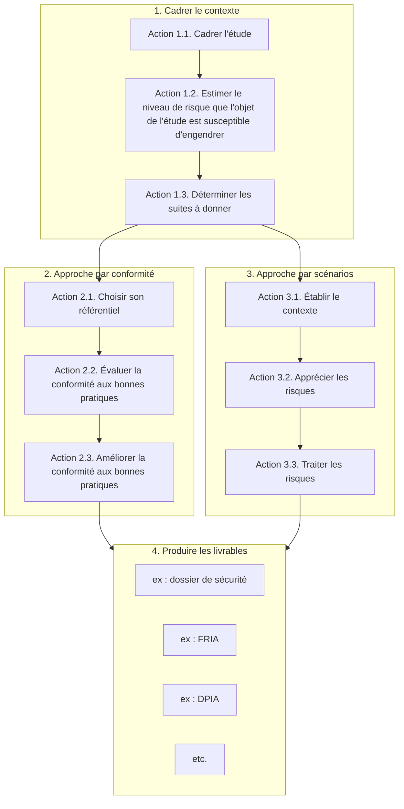
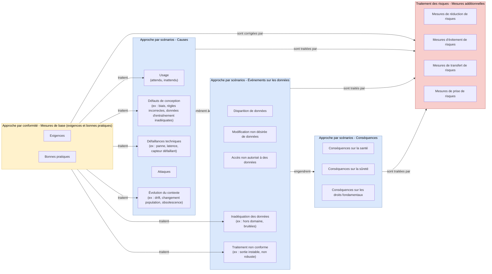

# Intelligence artificielle (IA) - Méthode de gestion des risques

## Objet du document
**Ce document propose une démarche pour gérer les risques spécifiques aux produits et services qui reposent sur des systèmes l'intelligence artificielle (IA)**.
Il a pour vocation à s'inscrire dans les démarches existantes au sein des organismes, notamment les processus d'homologation de systèmes, mais peut également être directement utilisé.

**[Avant-propos](#avant-propos)**  
**[Introduction](#introduction)**  
**[Étape 1. Cadrer le contexte](#étape-1-cadrer-le-contexte)** 
&nbsp;&nbsp;&nbsp;&nbsp;[Action 1.1. Cadrer l'étude](#action-11-cadrer-létude) 
&nbsp;&nbsp;&nbsp;&nbsp;[Action 1.2. Estimer le niveau de risque que l'objet de l'étude est susceptible d'engendrer](#action-12-estimer-le-niveau-de-risque-que-lobjet-de-létude-est-susceptible-dengendrer) 
&nbsp;&nbsp;&nbsp;&nbsp;[Action 1.3. Déterminer les suites à donner](#action-13-déterminer-les-suites-à-donner)  
**[Étape 2. L'approche par conformité](#étape-2-lapproche-par-conformité)** 
&nbsp;&nbsp;&nbsp;&nbsp;[Action 2.1. Choisir son référentiel](#action-21-choisir-son-référentiel) 
&nbsp;&nbsp;&nbsp;&nbsp;[Action 2.2. Évaluer la conformité aux bonnes pratiques](#action-22-évaluer-la-conformité-aux-bonnes-pratiques) 
&nbsp;&nbsp;&nbsp;&nbsp;[Action 2.3. Améliorer la conformité aux bonnes pratiques](#action-23-améliorer-la-conformité-aux-bonnes-pratiques)  
**[Étape 3. L'approche par scénarios](#étape-3-lapproche-par-scénarios)** 
&nbsp;&nbsp;&nbsp;&nbsp;[Action 3.1. Établir le contexte](#action-31-établir-le-contexte) 
&nbsp;&nbsp;&nbsp;&nbsp;[Action 3.2. Apprécier les risques](#action-32-apprécier-les-risques) 
&nbsp;&nbsp;&nbsp;&nbsp;[Action 3.3. Traiter les risques](#action-33-traiter-les-risques)  
**[Étape 4. Produire les livrables](#étape-4-produire-les-livrables)** 

## Avant-propos
Ce document s'inscrit dans un [ensemble de documents méthodologiques](https://github.com/matthieu-grall/ai), en amélioration continue, destinés à aider les organismes à gérer les risques liés à l'IA, et qui peuvent être utiles ensemble ou séparément.
Les [documents de référence](https://github.com/matthieu-grall/ai/blob/main/fr/IA%20-%20Gestion%20des%20risques%20-%20Documents%20de%20r%C3%A9f%C3%A9rence.md) sont utilisés entre crochets dans le corps du document.

Il est placé sous la **licence** suivante :
_[Creative Commons Attribution 4.0 International License][cc-by]_.

[![CC BY 4.0][cc-by-image]][cc-by]

[cc-by]: http://creativecommons.org/licenses/by/4.0/
[cc-by-image]: https://i.creativecommons.org/l/by/4.0/88x31.png
[cc-by-shield]: https://img.shields.io/badge/License-CC%20BY%204.0-lightgrey.svg

Les principaux **contributeurs** sont les suivants :
- Matthieu GRALL.

Les **versions** du document sont les suivantes :
| 
Version
 | 
Action
 | 
Éditeur
 |
| --- | --- | --- |
| 28/03/2025 (v0.1) | Création du document, ajout des documents de références, du tableau périodique de cas d'usages et des critères de confiance | Matthieu GRALL |
| 05/04/2025 (v0.2) | Déplacement du tableau périodique de cas d'usages dans un autre document | Matthieu GRALL |
| 10/04/2025 (v0.3) | Déplacement des critères de confiance et des bonnes pratiques dans d'autres documents, améliorations mineures (mise en cohérence avec les autres documents) | Matthieu GRALL |
| 23/04/2025 (v0.4) | Transformation du document en _markdown_ | Matthieu GRALL |
| 07/05/2025 (v1.0) | Finalisation d'une première version complète, cohérente, et en _markdown_ | Matthieu GRALL |
| 11/07/2025 (v1.1) | Simplification et harmonisation des chapitres introductifs, corrections mineures | Matthieu GRALL |
| 20/07/2025 (v1.2) | Amélioration de l'étape 1 (identification du cas d'usage et échelle), corrections mineures | Matthieu GRALL |
| 23/10/2025 (v1.3) | Corrections mineures (mise en cohérence des libellés courts des documents de référence qui ont été changés, harmonisation des balises "br", correction d'une phrase) | Matthieu GRALL |
| 05/11/2025 (v1.4) | Développement de la méthode et d'une étude de cas (en cours) | Matthieu GRALL |
| 07/11/2025 (v1.5) | Développement de l'évaluation de la conformité de l'étude de cas et extraction de l'ensemble des éléments relatifs à cette étude de cas (en cours) pour en faire une annexe afin d'améliorer la lisibilité de la méthode | Matthieu GRALL |
| 14/04/2026 (v1.6) | Ajout d'un schéma de flux avec Mermaid, ajout d'une étape 4 sur la production des livrables, améliorations mineures (déplacements, harmonisations, corrections) | Matthieu GRALL |
| 16/04/2026 (v1.7) | Normalisation des références, suppression de l'annexe, ajout de références à [ISO-27090] et [ISO-42102], correction de liens rompus | Matthieu GRALL |

## Introduction
On peut autant considérer l'IA comme :
1. **une technologie comme les autres**, sur laquelle de nouveaux services numériques vont pouvoir reposer, et dont il conviendra d'apprécier et de traiter les risques spécifiques ;
2. **une réelle opportunité d'améliorer nos capacités cyber** dans tous les domaines de lutte ;
3. **un levier démultiplicateur des capacités offensives adverses**, contre lesquelles on va devoir lutter.

Pour les deux premiers points, l'enjeu est le même : **améliorer la confiance envers l'IA** !

Or, un système d'IA est susceptible d'engendrer des **risques qui ne se limitent pas à la sécurité de l'information, et qui sont amplifiés par la frénésie actuelle** qui réduit la prise de recul :
- **sur les organismes**, du fait de défauts de qualité des données et légalité de leur obtention / traitement, et de technologies qui apportent leurs lots de vulnérabilités ;
- **sur les personnes**, avec notamment des biais sur les données d'entrainement, d'entrée et de sortie, qui peuvent mener à des discriminations ;
- **sur l'environnement**, car les technologies sur lesquelles reposent les outils d'IA sont parfois très gourmandes en ressources.

Ce document propose donc une **méthode de gestion des risques liés à l'IA**, qui :
1. décrit le cas d'usage et estime _a priori_ un **niveau de risque** sur l'organisme, sur les personnes et sur l'environnement ;
2. compare les pratiques envisagées aux bonnes pratiques via une **approche par conformité** ;
3. pour les systèmes d'IA susceptibles d'engendrer les risques les plus élevés, explique comment les apprécier et les traiter via une **approche par scénarios**.

En synthèse, la méthode peut être présentée de la manière suivante :

Cette méthode :
- s'inscrit dans les démarches d'homologation existantes (cf. [ANSSI-Homologation]) ;
- repose sur la méthode [ANSSI-EBIOSRM] ;
- respecte donc les principes de gestion des risques ([ISO-31000], [ISO-27005], etc.) ;
- contribue à satisfaire les exigences afférentes des systèmes de management ([ISO-27001], [ISO-42001], [ISO-14001]).

## Étape 1. Cadrer le contexte
L'objectif est de **proportionner l'étude au niveau de risque que le cas d'usage est susceptible d'engendrer**.

Note : le cas échéant, le résultat de cette étape peut utilement être intégré à la stratégie d'homologation.

### Action 1.1. Cadrer l'étude

Il convient tout d'abord d'identifier clairement :
- l’**objet de l’étude** : le cas d'usage / traitement de données considéré (cas d'usage seul ou périmètre plus large, de manière intelligible pour que toutes les parties intéressées comprennent bien de quoi il s'agit) ;
- l’**objectif de l’étude** (ex : homologuer un système) ;
- les **destinataires de l’étude** (ex : commission d’homologation) ;
- les **thématiques à considérer** : protection des droits fondamentaux (cf. [EU-AIAct]), protection de la vie privée (cf. [EU-GDPR]), sécurité de l'information (cf. [ISO-27001]), protection de l'environnement (cf. [ISO-14001]), etc.

### Action 1.2. Estimer le niveau de risque que l'objet de l'étude est susceptible d'engendrer

La gravité des conséquences des risques que l'objet de l'étude est susceptible d'engendrer devrait être estimée _a priori_ afin de pouvoir proportionner la profondeur de l'étude.

Pour ce faire, il convient de :
- **définir une/des échelle(s)** qui décri(ven)t les niveaux de risque pour chaque thématique considérés ;
- **situer l'objet de l'étude dans la/les échelle(s) définie(s)**, au regard des conséquences imaginables :
    - de son fonctionnement nominal : sa finalité, les données traitées, la nature et le volume de personnes concernées, les technologies utilisées ;
	- de son dysfonctionnement ;
	- et surtout, des risques liés à la sécurité des données : disparition, modification non désirée ou accès non autorisé ;
- **retenir le niveau le plus élevé**.

Notes :
- selon le contexte, on peut choisir de considérer toutes les thématiques possibles (pour avoir une vision large) ou uniquement certaines, voire une seule (ex : périmètre de compétence limité) ;
- cette démarche ne préjuge en rien des obligations et interdictions applicables (ex : « IA à risque inacceptable » interdite par le [Règlement IA]).

### Action 1.3. Déterminer les suites à donner

**Les suites à donner sont déterminées en fonction du niveau de risque** :

| 
Niveau de risque
 | 
Approche par conformité (étape 2)
 | 
Approche par scénario (étape 3)
 |
| --- | --- | --- |
| 1. Minimal | Pas utile | Pas utile |
| 2. Faible | Conseillée | Pas utile |
| 3. Élevé | Oui | Oui |
| 4. Maximal | Oui | Oui |

## Étape 2. L'approche par conformité
L'approche par conformité devrait être mise en œuvre à partir du niveau de risque 3. Élevé (également conseillée pour 2. Faible).

Elle permet de **gérer les risques standards**, y compris ceux de cause accidentelle, **et les attaques cyber non ciblées**.

L'objectif est de **comparer les pratiques mises en oeuvre ou prévues pour le cas d'usage aux bonnes pratiques**, afin d'éclairer la prise de décision.

Notes :
- cette approche correspond à la « déclaration d'applicabilité » de l'[ISO-27001] et à l'« évaluation du socle de règles » de l'atelier 1 d'[ANSSI-EBIOSRM] ;
- le cas échéant, le résultat de cette étape peut être intégré au dossier d'homologation.

### Action 2.1. Choisir son référentiel

Parmi les nombreux référentiels de bonnes pratiques, il convient de **choisir le(s) plus pertinent(s) selon son contexte**, notamment :
- pour avoir une vision synthétique et large, ou à défaut d'un choix précis de référentiel(s), il est possible d'utiliser tout ou partie des [bonnes pratiques pour l'IA](https://github.com/matthieu-grall/ai/blob/main/fr/IA%20-%20Gestion%20des%20risques%20-%20Bonnes%20pratiques.md) ;
- si une politique interne est censée couvrir les référentiels applicables à l'organisation, il peut être pertinent d'en choisir les règles applicables au cas d'usage ;
- si le périmètre de compétence est limité (ex : si on ne peut traiter que de sécurité de l'information, il peut être pertinent de choisir le [ANSSI-Hygiene] ou le [CNIL-Securite] (selon le niveau de maturité), et les [ANSSI-AIRecos]) ;
- si certains référentiels doivent être employés (ex : s'il y a des données à caractère personnel, il peut être pertinent de choisir les [EU-AIPD], le [CNIL-Securite] et les [CNIL-AIRecos]) ;
- etc.

### Action 2.2. Évaluer la conformité aux bonnes pratiques

Pour ce faire, l'organisation devrait évaluer chacune des bonnes pratiques retenues :
- **si elle est jugée comme applicable** :
    - fournir des explications :
	    - **si elle est appliquée, comment ?** L'explication fournie doit permettre d'évaluer le respect de la bonne pratique ;
	    - **si elle n'est pas appliquée, quelles sont les mesures compensatoires ?** L'explication fournie doit permettre d'évaluer que les mesures prévues sont suffisantes pour atteindre un niveau de confiance aussi bon que si la bonne pratique était appliquée ;
- **si elle est jugée comme non applicable, pourquoi ?** L'explication fournie doit permettre de juger de son inapplicabilité (un chapitre entier peut être exclu s'il est traité par ailleurs ou en dehors de sa responsabilité, une bonne pratique sur un LLM n'est applicable qu'aux LLM, etc.) ;
 
Le modèle de déclaration d'applicabilité en annexe des [bonnes pratiques pour l'IA](https://github.com/matthieu-grall/ai/blob/main/fr/IA%20-%20Gestion%20des%20risques%20-%20Bonnes%20pratiques.md) peut être utilisé à cet effet.
 
Note : l'objectif n'est pas de respecter toutes les bonnes pratiques, mais de décrire ce qui est réellement prévu au regard de celles-ci.

### Action 2.3. Améliorer la conformité aux bonnes pratiques

Pour chaque bonne pratique applicable, l'organisation devrait :
- **déterminer les mesures** qui permettraient d'améliorer la conformité ;
- **les inscrire dans un plan de traitement des risques** ;
- si besoin, **évaluer les risques résiduels** (qui subsisteraient après application du plan de traitement des risques), de manière synthétique (ex : en formulant un événement qui pourrait se réaliser malgré les mesures prévues et ses conséquences potentielles), dans l'objectif de convaincre l'autorité que les risques résiduels ont été analysés, et qu'ils sont acceptables.

La dernière colonne du modèle de déclaration d'applicabilité en annexe des [bonnes pratiques pour l'IA](https://github.com/matthieu-grall/ai/blob/main/fr/IA%20-%20Gestion%20des%20risques%20-%20Bonnes%20pratiques.md) peut être utilisé à cet effet.

## Étape 3. L'approche par scénarios
L'approche par scénarios devrait être mise en œuvre à partir du niveau de risque 3. Élevé.

Elle permet de **gérer les attaques cyber avancées et ciblées**.

L'objectif est d'**identifier** et d'**apprécier les risques** que le cas d'usage est susceptible d'engendrer sur la/les thématiques(s) retenue(s), de **déterminer les mesures pour les traiter**, et de **présenter les risques résiduels** pour éclairer une prise de décision.

Pour ce faire, il convient de **mener une étude de risques par scénarios sur le cas d'usage avec les spécificités de l'IA**, par exemple en appliquant [ANSSI-EBIOSRM] au contexte spécifique des systèmes d'IA.

### Action 3.1. Établir le contexte

L'établissement du contexte (qui peut être réalisé avant ou pendant les processus suivants) devrait :
- détailler la **description de l'objet de l'étude** :
    - sa **mission** : la finalité du cas d’usage ;
	- ses **valeurs métier** (processus et données à protéger), notamment :
	    - ses **fonctionnalités d’IA** utilisées (voir les [cas d'usages](https://github.com/matthieu-grall/ai/blob/main/fr/IA%20-%20Gestion%20des%20risques%20-%20Cas%20d'usages.md)) ;
		- le cas échéant, les **données d'entrainement** ;
		- les **données d'entrée** et leurs sources ;
		- les **données de sortie** et leurs destinataires ;
		- si possible, une **description fonctionnelle** (simple, ex : un schéma qui montre les sources de données, la chaine de traitements réalisés, les flux de données entre les traitements, jusqu'aux destinataires des données) ;
    - ses **biens supports** (matériels, logiciels, réseaux, personnes, organisations, canaux interpersonnels et locaux, sur lesquels reposent les valeurs métier et les mesures), notamment :
	    - les systèmes nécessaires à la mise en œuvre de l'objet de l'étude, notamment le **système d'IA** ;
		- si possible, leurs composants, notamment les **techniques d’IA** employées (voir les [cas d'usages](https://github.com/matthieu-grall/ai/blob/main/fr/IA%20-%20Gestion%20des%20risques%20-%20Cas%20d'usages.md)) ;
		- si possible, une **description technique** (simple, ex : un schéma qui montre les systèmes utilisés, leurs interfaces et les fonctions qui peuvent y accéder) ;
	- ses **parties prenantes** (acteurs en dehors de l’objet de l’étude, qui interagissent avec celui-ci), notamment :
	    - le cas échéant, les **fournisseurs** ;
		- le cas échéant, les **clients** ;
		- autres ;
    - le cas échéant, les **éléments spécifiques requis par certains référentiels** (ex : durées d'utilisation prévues pour se conformer au [Règlement IA]) ;

- définir les **échelles de l’étude** (et qui devraient donc être adaptées au contexte, et comprises par les parties intéressées) :
    - pour **estimer la gravité des conséquences** (selon le contexte) :
		- sur les personnes ;
	    - sur l'organisation ;
		- sur les droits fondamentaux ;
		- sur l'environnement ;
		- autres ;
    - pour **estimer la vraisemblance des scénarios** ;
	- pour **évaluer les risques** et les risques résiduels.

Notes :
- cette approche emploie les outils utiles de la boîte à outils d’[ANSSI-EBIOSRM] ;
- elle correspond aux processus d' « établissement du contexte », d' « appréciation des risques » et de « traitement des risques » des normes relatives à la gestion des risques (ex : [ISO-31000], [ISO-27005]) ;
- le cas échéant, le résultat de cette étape peut constituer le cœur du dossier d'homologation ;
- l'[ISO-42102] peut être utile pour réaliser cette action.

### Action 3.2. Apprécier les risques

L'appréciation des risques devrait :
- apprécier les **événements redoutés** :
    - situer les conséquences potentielles d'une disparition de données, d'une modification non désirée de données et d'un accès non autorisé à des données correspondant à chaque valeur métier dans chaque échelle de gravité définie à cet effet ;
	- retenir la gravité la plus élevée ;
	- si possible, illustrer les événements redoutés ainsi analysés par un exemple parlant ;
- analyser les **sources de risques** :
    - identifier les attaquants qui sont les plus susceptibles d’engendrer chaque événement redouté ;
    - déterminer leurs objectifs visés (ils peuvent être au-delà de l'objet de l'étude) ;
- analyser les **scénarios stratégiques** :
    - identifier les différents chemins que les sources de risques identifiées sont les plus susceptibles d'emprunter au sein des parties prenantes pour mener à chaque événement redouté et atteindre leurs objectifs visés (ex : attaque directe de l’objet de l’étude, compromission d’un produit d’un fournisseur) ;
	- retenir le plus vraisemblable ;
- apprécier les **scénarios opérationnels** :
    - analyser les différentes chaînes d'attaque (séquences d'actions élémentaires qui exploitent les vulnérabilités des biens supports) que les sources de risques sont susceptibles de réaliser pour mettre en œuvre les scénarios stratégiques retenus (pour les attaques spécifiques aux systèmes d'IA, se référer à l'[ISO-27090] ou aux fiches du [HubFranceIA-Guide] ou à [MITRE-ATLAS]) ;
	- si possible, formuler un libellé court et parlant pour les scénarios opérationnels ainsi analysés ;
    - estimer leur vraisemblance à l'aide de l'échelle définie à cet effet, compte tenu des mesures existantes ou prévues ;
	- retenir le scénario opérationnel le plus vraisemblable ;
- déterminer les **risques** :
    - constituer les risques : ils sont composés d'un événement redouté et du scénario opérationnel retenu ;
    - déterminer leurs niveaux : la gravité est celle de l’événement redouté considéré, la vraisemblance est celle du scénario opérationnel retenu ;
    - évaluer les risques : les positionner dans l'échelle définie à cet effet.

### Action 3.3. Traiter les risques

Le traitement des risques devrait :
- déterminer les **mesures** : si possible, tout au long de l'étude, ou sinon après l'appréciation des risques, déterminer les mesures qui contribuent à traiter les événements redoutés, les sources de risques, les scénarios stratégiques et les scénarios opérationnels (considérer les mesures spécifiques aux systèmes d'IA en annexe du [HubFranceIA-Guide] et celles de [MITRE-ATLAS] ou [ISO-27090], ainsi que les recommandations ([ANSSI-AIRecos], [CNIL-AIRecos], etc.) qui n'auraient pas été retenues dans l'étape précédente) ;
- compléter le **plan de traitement des risques** : planifier les mesures déterminées ;
- réestimer la gravité et la vraisemblance des risques résiduels (qui subsistent après application des mesures) ;
- si besoin, repositionner les risques sur la **cartographie des risques** ;
- le cas échéant, **déterminer des mesures complémentaires** jusqu'à rendre les risques acceptables ou proposer d'accepter les risques tels quels.

## Étape 4. Produire les livrables
Si besoin, notamment lorsque la réglementation l'impose, il s'agit ici de produire les livrables souhaités à partir des éléments de l'étude.

L'objectif est de maximiser l'utilisation des éléments de l'étude dans la création de chaque livrable et la rééutilisation des mêmes éléments pour produire plusieurs livrables.

Pour ce faire, il convient de :

<**à rédiger**>

## Annexe : logique générale

